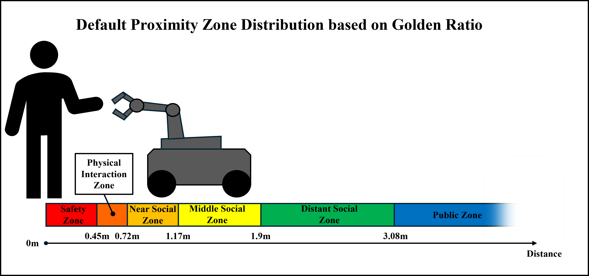

# GRIZoD-HRI  
**Golden Ratio-based Interaction Zone Distribution for Human-Robot Interaction**

---

## Overview

GRIZoD-HRI is an algorithm designed to optimize interaction zones between humans and robots by leveraging the Golden Ratio for spatial distribution. This approach enhances safety and comfort in Human-Robot Interaction (HRI) scenarios by defining natural, balanced zones that guide robot behavior.
<div align="center">
  
</div>

This algorithm was developed using Stereolabs' ZED 2i depth camera and tested on the quadruped robot Unitree Go1 and the wheeled robot Agilex Scout Mini. 

<div align="center">
  
</div>

---

## Features

- Calculates personal comfort zones using the Golden Ratio.
- Dynamic adjustment of zones based on relative human-robot velocity.  
- Safety zone is defined by ISO 13482:2014 and ISO 13855:2010 standard.  
- Adaptable to various robot platforms and environments  
- Dynamic robot velocity based on 2D Gaussian function  

---

## Prerequisites

To run GRIZoD-HRI, you need to install the **ZED SDK** by [Stereolabs](https://www.stereolabs.com/developers/).

- The ZED SDK provides depth sensing and spatial mapping capabilities essential for the algorithm.
- Please follow the official installation instructions for your operating system:  
  [ZED SDK Downloads and Installation](https://www.stereolabs.com/developers/)

---

## Installation

```bash
git clone https://github.com/Shiki-CZ/GRIZoD-HRI.git
cd GRIZoD-HRI
